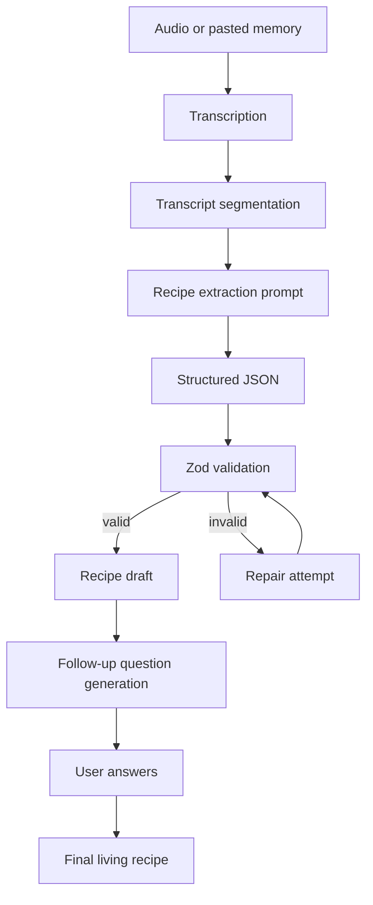

# RecipeTrace AI Pipeline

## Pipeline goal

The AI pipeline converts unstructured cooking memory into a source-backed living recipe.

The pipeline should optimize for:

1. preserving tacit cooking knowledge
2. avoiding hallucinated precision
3. producing validated structured data
4. linking generated outputs to transcript evidence
5. surfacing missing information as follow-up questions

## High-level flow



## Stage 1: Transcription

Input:

- browser-recorded audio
- uploaded audio file
- pasted transcript fallback

Output:

```ts
type RawTranscript = {
  text: string;
  segments?: {
    text: string;
    startMs?: number;
    endMs?: number;
    speaker?: string;
  }[];
};
```

Implementation notes:

- Use provider timestamps if available.
- If timestamps are unavailable, segment the transcript manually into sentence or paragraph chunks.
- Always assign stable segment IDs.

## Stage 2: Transcript segmentation

The extractor should not receive one giant blob only. It should receive numbered segments.

Example:

```json
[
  {
    "id": "seg_001",
    "speaker": "Auntie",
    "text": "First I fry the onions until they get a little golden, not too dark.",
    "startMs": 1200,
    "endMs": 6400
  },
  {
    "id": "seg_002",
    "speaker": "Auntie",
    "text": "Then I add ginger garlic and wait until the raw smell goes away.",
    "startMs": 6500,
    "endMs": 10200
  }
]
```

Why this matters:

- every recipe step can cite source evidence
- UI can highlight support
- evals can verify that the model is not inventing unsupported steps

## Stage 3: Structured extraction

### Extraction system prompt

```text
You are a culinary knowledge extraction engine.

Your job is not to invent a recipe. Your job is to transform a messy family cooking memory into structured, cookable knowledge while preserving uncertainty.

Return strict JSON only.

Extract:
1. dish_name
2. cultural_or_family_context
3. ingredients
4. steps
5. sensory_cues
6. missing_details
7. follow_up_questions
8. provenance_links

Rules:
- Never fabricate exact quantities unless the speaker gave them.
- If the speaker says "a little", "until it smells right", "until glossy", or "you'll know by the sound", preserve that as tacit knowledge.
- Prefer uncertainty over false precision.
- Every recipe step must include transcript_segment_ids that support it.
- Follow-up questions should target the most important missing cooking details.
- Separate factual instructions from inferred suggestions.
- If a step is inferred, mark it as inferred.
- If no source segment supports a step, do not include the step.
```

### Extraction user prompt template

```text
Convert the following transcript segments into a structured living recipe.

Transcript segments:
{{SEGMENTS_JSON}}

Return JSON matching the provided schema.

Remember:
- preserve vague quantities
- capture sensory cues
- generate follow-up questions
- include provenance links for every step
```

## Stage 4: Schema validation

Use Zod validation after every AI extraction.

Minimum schema constraints:

- `dishName` required
- at least one ingredient
- at least three recipe steps for the seeded demo
- each step must include at least one provenance link
- each provenance link must reference a real transcript segment ID
- every inferred ingredient or step must be marked `isInferred: true`
- missing quantities should remain `undefined`, `"to taste"`, or `"unspecified"`, not hallucinated exact values

## Stage 5: Repair strategy

If validation fails, do not blindly continue.

Repair prompt:

```text
The previous JSON failed validation.

Validation errors:
{{ERRORS}}

Original transcript segments:
{{SEGMENTS_JSON}}

Invalid JSON:
{{BAD_JSON}}

Return corrected strict JSON only.

Do not add unsupported details. Every recipe step must cite valid transcript segment IDs.
```

Only attempt repair once. If repair fails, show an error and allow the seeded demo.

## Stage 6: Follow-up question generation

Follow-up questions should be practical, not generic.

Good question:

```text
How much water should be added after the spices fry, and what texture should the mixture have before simmering?
```

Bad question:

```text
Can you give more details?
```

Question fields:

```ts
type OpenQuestion = {
  id: string;
  question: string;
  whyItMatters: string;
  targetField: "ingredient" | "step" | "timing" | "temperature" | "texture" | "serving" | "context";
  priority: "low" | "medium" | "high";
};
```

Prioritize questions about:

1. missing quantities
2. doneness cues
3. timing
4. heat level
5. order of operations
6. substitutions
7. serving/storage

## Stage 7: Final living recipe generation

The final living recipe should combine:

- original recipe draft
- follow-up answers
- unresolved missing details
- source evidence

Important rule:

If a follow-up answer resolves a detail, mark it as user-provided. If a detail is still unknown, keep it visibly unresolved.

## Final recipe output shape

```ts
type LivingRecipe = {
  title: string;
  summary: string;
  familyContext?: string;
  ingredients: Ingredient[];
  steps: RecipeStep[];
  sensoryCues: string[];
  unresolvedQuestions: OpenQuestion[];
  sourceSummary: {
    transcriptSegmentCount: number;
    supportedStepCount: number;
    inferredStepCount: number;
  };
};
```

## Seeded demo transcript requirements

The seeded transcript should include:

- 8-12 transcript segments
- a named dish
- vague quantities
- sensory cues
- missing timings
- at least one family/cultural memory
- at least one ambiguous phrase
- enough detail to produce 5-8 steps

Example phrases to include:

- "not too dark"
- "until the raw smell goes away"
- "just enough water so it loosens"
- "you'll hear it stop spluttering"
- "we never measured it"
- "my grandmother used to do it this way"

## Output quality rules

The system should reward:

- source-backed steps
- sensory cue preservation
- uncertainty preservation
- useful follow-up questions
- clear separation between fact and inference

The system should penalize:

- hallucinated exact quantities
- unsupported steps
- generic recipe filler
- ignoring sensory cues
- hiding uncertainty
- producing recipe instructions without provenance

## Example extraction output

```json
{
  "dishName": "Family Chicken Curry",
  "familyContext": "The speaker describes a family method learned through observation rather than written measurements.",
  "ingredients": [
    {
      "id": "ing_001",
      "name": "onions",
      "quantity": "unspecified",
      "preparation": "sliced",
      "isInferred": false,
      "confidence": "high",
      "provenance": [
        {
          "transcriptSegmentId": "seg_001",
          "quote": "I fry the onions until they get a little golden",
          "reason": "The speaker explicitly names onions and describes how to cook them."
        }
      ]
    }
  ],
  "steps": [
    {
      "id": "step_001",
      "orderIndex": 1,
      "instruction": "Fry the sliced onions until they are lightly golden, but not too dark.",
      "sensoryCues": ["lightly golden", "not too dark"],
      "timing": "unspecified",
      "temperature": "unspecified",
      "isInferred": false,
      "confidence": "high",
      "provenance": [
        {
          "transcriptSegmentId": "seg_001",
          "quote": "until they get a little golden, not too dark",
          "reason": "This phrase directly supports the doneness cue for the onions."
        }
      ]
    }
  ],
  "sensoryCues": ["lightly golden", "raw smell goes away"],
  "missingDetails": ["Exact onion quantity", "Heat level", "Total cooking time"],
  "followUpQuestions": [
    {
      "id": "q_001",
      "question": "How many onions do you usually use for one batch?",
      "whyItMatters": "The transcript mentions onions but does not specify quantity.",
      "targetField": "ingredient",
      "priority": "high"
    }
  ]
}
```

## Implementation priorities

### First priority

- seeded transcript
- extraction schema
- validated extraction
- recipe draft UI
- provenance click interaction

### Second priority

- audio recording/upload
- transcription route
- follow-up answers
- final recipe generation

### Third priority

- timestamp playback
- export markdown
- multi-memory comparison
