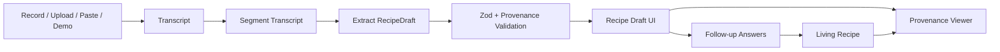

# RecipeTrace Build Brief

## Positioning

RecipeTrace converts messy family cooking voice memories into structured, source-backed living recipes.

This is not a recipe generator. The product bet is that emotionally meaningful cooking knowledge is often vague, sensory, and tacit: "until it smells right", "not too dark", "enough water so it loosens", "you'll hear it stop spluttering". The prototype should preserve that knowledge instead of flattening it into fake precision.

Main tradeoff: coarse but trustworthy extraction is better than overbuilt recipe generation. A short, visibly source-backed recipe with uncertainty is more valuable than a polished recipe that invents quantities, timings, or steps.

## Shipping Target

Build one polished full-stack slice:

1. Capture a cooking memory through seeded demo, audio, upload, or pasted transcript.
2. Display transcript segments with stable IDs.
3. Extract a Zod-validated `RecipeDraft`.
4. Show ingredients, steps, sensory cues, missing details, follow-up questions, and confidence.
5. Let the user click a generated step and see transcript evidence.
6. Let the user answer at least one follow-up question.
7. Generate a final living recipe that keeps unresolved uncertainty visible.

The seeded demo must work with no API keys. Live APIs are additive.

## Must Ship

- Seeded demo path that works offline
- Browser recording or audio upload UI
- Pasted transcript fallback
- Transcript display with stable segment IDs
- Zod-validated `RecipeDraft` JSON
- Sensory cue extraction grouped by `look`, `smell`, `sound`, `texture`, `timing`, `temperature`
- Uncertainty and missing detail detection
- Follow-up question generation
- Final living recipe view
- Provenance links from every recipe step to transcript spans
- Loading, empty, and error states for the main path

## Explicit Non-Goals

- Accounts
- Recipe library
- Collaboration
- Nutrition
- Shopping lists
- Image generation
- Multi-recipe comparison
- Audio timestamp playback
- Complex edit history
- Production privacy controls beyond basic API key safety

## Demo Quality Bar

The demo should communicate the product in under one minute.

Seeded demo requirements:

- 8-12 transcript segments
- named family dish
- vague quantities
- sensory cues in at least four cue categories
- at least three missing details
- at least three specific follow-up questions
- 5-7 generated recipe steps
- provenance on every step

The reviewer should be able to click any recipe step and immediately see why the app believes that step is supported.

## Architecture

Use Next.js App Router, TypeScript, Tailwind/shadcn, Zod, and API routes. Use Supabase/Postgres only if it is already easy to wire; local fixtures plus API state are enough for the 12-hour prototype.



## Frontend Structure

Build the first screen as the actual workspace, not a marketing page.

Core panels:

- Capture panel: `Try Demo`, record/upload, paste transcript
- Transcript panel: numbered segments, speaker, text, optional timestamps, selected highlight
- Recipe draft panel: dish, context, ingredients, steps, sensory cues, missing details, follow-ups
- Provenance panel: selected step, source segment IDs, quote, support reason
- Living recipe view: final recipe, user-provided answers, unresolved questions, source summary

Important interaction:

- Clicking a recipe step sets `selectedStepId`.
- The app reads `step.provenance[]`.
- Matching transcript segments are highlighted.
- Provenance panel shows quotes and reasons.

## Server Pipeline

### 1. Capture

Create a capture session from demo, pasted transcript, audio upload, or browser recording.

### 2. Transcribe

If audio exists and provider keys are configured, transcribe it. Use OpenAI or Deepgram. If transcription fails, return a clear error and keep demo/paste paths available.

Never fabricate a transcript for user audio.

### 3. Segment

Normalize all transcript inputs into `TranscriptSegment[]`.

Rules:

- Always assign stable IDs: `seg_001`, `seg_002`, etc.
- Use provider timestamps when available.
- If timestamps are unavailable, split by provider segments, paragraphs, or sentences.
- The extractor receives segments, not one unstructured blob.

### 4. Extract

Use OpenAI structured outputs to produce `RecipeDraft`.

Rules:

- Extract knowledge; do not invent a recipe.
- Preserve vague quantities.
- Capture sensory cues as structured data.
- Generate missing details and follow-up questions.
- Every recipe step must include provenance.
- Unsupported generated steps should be omitted, not guessed.

### 5. Validate

Run Zod validation and extra provenance checks before returning the draft to the client.

Reject or repair:

- invalid schema
- missing step provenance
- provenance pointing to nonexistent segment IDs
- invalid sensory cue type
- inferred exact quantities without transcript support

### 6. Repair Once

If live extraction fails validation, make one repair call with validation errors, original segments, and invalid JSON. If repair fails, return validation errors. For demo captures only, fall back to seeded extraction.

### 7. Finalize

For the prototype, finalization should be deterministic: merge draft plus follow-up answers into `LivingRecipe`. Use an LLM for polish only after the core flow is stable.

If an answer resolves a missing detail, mark it as user-provided. If uncertainty remains, keep it visible.

## Shared Data Contracts

Implement these in `src/lib/schema/recipe.ts` as Zod schemas and inferred TypeScript types. Fixtures, API routes, and UI should all use the same contracts.

```ts
export const confidenceValues = ["low", "medium", "high"] as const;

export const cueTypeValues = [
  "look",
  "smell",
  "sound",
  "texture",
  "timing",
  "temperature",
] as const;

export const captureStatusValues = [
  "created",
  "transcribed",
  "extracted",
  "finalized",
  "failed",
] as const;
```

```ts
export type TranscriptSegment = {
  id: string;
  captureId: string;
  orderIndex: number;
  speaker?: string;
  text: string;
  startMs?: number;
  endMs?: number;
};

export type ProvenanceLink = {
  transcriptSegmentId: string;
  quote: string;
  reason: string;
};

export type SensoryCue = {
  id: string;
  type: "look" | "smell" | "sound" | "texture" | "timing" | "temperature";
  cue: string;
  interpretation?: string;
  provenance: ProvenanceLink[];
};

export type Ingredient = {
  id: string;
  name: string;
  quantity?: string;
  unit?: string;
  preparation?: string;
  optional: boolean;
  isInferred: boolean;
  confidence: "low" | "medium" | "high";
  provenance: ProvenanceLink[];
};

export type RecipeStep = {
  id: string;
  orderIndex: number;
  instruction: string;
  timing?: string;
  temperature?: string;
  sensoryCueIds: string[];
  isInferred: boolean;
  confidence: "low" | "medium" | "high";
  provenance: ProvenanceLink[];
};

export type MissingDetail = {
  id: string;
  label: string;
  whyItMatters: string;
  target:
    | "ingredient"
    | "step"
    | "timing"
    | "temperature"
    | "texture"
    | "serving"
    | "context";
  severity: "low" | "medium" | "high";
  relatedStepIds?: string[];
  relatedIngredientIds?: string[];
};

export type FollowUpQuestion = {
  id: string;
  question: string;
  whyItMatters: string;
  target: MissingDetail["target"];
  priority: "low" | "medium" | "high";
  relatedMissingDetailIds: string[];
};

export type FollowUpAnswer = {
  questionId: string;
  answer: string;
  answeredAt: string;
};

export type RecipeDraft = {
  id: string;
  captureId: string;
  dishName: string;
  familyContext?: string;
  summary?: string;
  ingredients: Ingredient[];
  steps: RecipeStep[];
  sensoryCues: SensoryCue[];
  missingDetails: MissingDetail[];
  followUpQuestions: FollowUpQuestion[];
  createdAt: string;
};

export type LivingRecipe = {
  id: string;
  captureId: string;
  title: string;
  summary: string;
  familyContext?: string;
  ingredients: Ingredient[];
  steps: RecipeStep[];
  sensoryCues: SensoryCue[];
  resolvedDetails: {
    questionId: string;
    answer: string;
    appliedTo?: string[];
  }[];
  unresolvedQuestions: FollowUpQuestion[];
  sourceSummary: {
    transcriptSegmentCount: number;
    supportedStepCount: number;
    inferredStepCount: number;
  };
  createdAt: string;
};
```

Minimum Zod rules:

- `RecipeDraft.dishName` is required
- seeded demo has at least 5 steps
- every step has at least one provenance link
- every provenance link references an existing transcript segment
- every cue type is one of the six allowed types
- inferred ingredients and steps explicitly set `isInferred: true`
- follow-up questions connect to at least one missing detail
- missing quantities remain omitted, `"unspecified"`, `"to taste"`, or similarly vague unless the transcript provides exact values

## Fixture Files

Commit fixtures before wiring providers:

```txt
src/lib/demo/transcript.ts
src/lib/demo/recipe-draft.ts
src/lib/demo/follow-up-answers.ts
src/lib/demo/living-recipe.ts
```

Fixtures must pass the same Zod schemas as live extraction.

## Optional Database Model

If persistence is added, normalize transcript segments and store drafts/final recipes as validated JSON.

Tables:

- `captures`: id, title, source_type, audio_url, status, error_message, created_at, updated_at
- `transcript_segments`: id, capture_id, order_index, speaker, text, start_ms, end_ms
- `recipe_drafts`: id, capture_id, json, created_at
- `follow_up_answers`: id, capture_id, question_id, answer, created_at
- `living_recipes`: id, capture_id, json, markdown, created_at

Do not block the prototype on database setup.

## API Routes

### `GET /api/demo`

Return the complete seeded demo.

```ts
{
  capture: Capture;
  transcriptSegments: TranscriptSegment[];
  recipeDraft: RecipeDraft;
  livingRecipe?: LivingRecipe;
}
```

This route must work without provider keys.

### `POST /api/captures`

Create a capture from demo, pasted transcript, or audio metadata.

```ts
{
  sourceType: "demo" | "paste" | "audio";
  title?: string;
  transcriptText?: string;
}
```

Return:

```ts
{
  capture: Capture;
  transcriptSegments?: TranscriptSegment[];
}
```

For `paste`, segment immediately. For `demo`, load fixtures.

### `POST /api/captures/:captureId/transcribe`

Transcribe uploaded or recorded audio.

```ts
{
  audioUrl?: string;
  fileName?: string;
}
```

Return:

```ts
{
  captureId: string;
  transcriptSegments: TranscriptSegment[];
}
```

Failure behavior:

- return a clear error
- do not fake transcript text for user audio
- keep seeded demo available

### `POST /api/captures/:captureId/extract`

Extract and validate `RecipeDraft`.

```ts
{
  transcriptSegments: TranscriptSegment[];
  useDemoFallback?: boolean;
}
```

Return:

```ts
{
  recipeDraft: RecipeDraft;
  validation: { ok: true };
}
```

Failure behavior:

- attempt one repair call
- return validation errors if repair fails
- only use seeded fallback when the capture is a demo

### `POST /api/captures/:captureId/followups`

Validate and store or echo follow-up answers.

```ts
{
  answers: FollowUpAnswer[];
}
```

### `POST /api/captures/:captureId/finalize`

Create `LivingRecipe` from draft plus answers.

```ts
{
  recipeDraft: RecipeDraft;
  answers: FollowUpAnswer[];
}
```

Return:

```ts
{
  livingRecipe: LivingRecipe;
}
```

### `POST /api/validate-draft`

Developer helper for fixtures and evals.

```ts
{
  transcriptSegments: TranscriptSegment[];
  recipeDraft: unknown;
}
```

Return:

```ts
{
  ok: boolean;
  errors: string[];
}
```

## Recommended Module Layout

```txt
src/lib/schema/recipe.ts
src/lib/transcript/segment.ts
src/lib/ai/transcribe.ts
src/lib/ai/extract-recipe.ts
src/lib/ai/repair-extraction.ts
src/lib/provenance/validate.ts
src/lib/recipe/finalize.ts
src/lib/demo/*
```

## AI Prompt Contract

System prompt:

```text
You are a culinary knowledge extraction engine.

Your job is not to invent a recipe. Your job is to transform a messy family cooking memory into structured, cookable knowledge while preserving uncertainty.

Return strict JSON only.

Extract:
1. dish_name
2. cultural_or_family_context
3. ingredients
4. steps
5. sensory_cues
6. missing_details
7. follow_up_questions
8. provenance_links

Rules:
- Never fabricate exact quantities unless the speaker gave them.
- If the speaker says "a little", "until it smells right", "until glossy", or "you'll know by the sound", preserve that as tacit knowledge.
- Prefer uncertainty over false precision.
- Every recipe step must include transcript_segment_ids that support it.
- Follow-up questions should target the most important missing cooking details.
- Separate factual instructions from inferred suggestions.
- If a step is inferred, mark it as inferred.
- If no source segment supports a step, do not include the step.
```

User prompt:

```text
Convert the following transcript segments into a structured living recipe.

Transcript segments:
{{SEGMENTS_JSON}}

Return JSON matching the provided schema.

Remember:
- preserve vague quantities
- capture sensory cues
- generate follow-up questions
- include provenance links for every step
```

Repair prompt:

```text
The previous JSON failed validation.

Validation errors:
{{ERRORS}}

Original transcript segments:
{{SEGMENTS_JSON}}

Invalid JSON:
{{BAD_JSON}}

Return corrected strict JSON only.

Do not add unsupported details. Every recipe step must cite valid transcript segment IDs.
```

## Follow-Up Question Quality

Good follow-up questions are specific and tied to cookability:

- "How much water do you add after frying the spices?"
- "What should the onions look like before adding the ginger garlic?"
- "Is the heat low, medium, or high during the simmer?"

Bad follow-up questions are generic:

- "Can you provide more details?"
- "What else should we know?"
- "Can you clarify the recipe?"

Prioritize questions about:

1. missing quantities
2. doneness cues
3. timing
4. heat level
5. order of operations
6. substitutions
7. serving/storage

## Environment Variables

```txt
OPENAI_API_KEY=
DEEPGRAM_API_KEY=
NEXT_PUBLIC_APP_URL=
SUPABASE_URL=
SUPABASE_ANON_KEY=
SUPABASE_SERVICE_ROLE_KEY=
```

Only `OPENAI_API_KEY` or `DEEPGRAM_API_KEY` should be needed for live provider paths. No environment variable should be required for the seeded demo.

## Build Sequence

### Hour 0-1: Contracts and Fixtures

Ship:

- shared Zod schemas
- seeded transcript with 8-12 segments
- seeded `RecipeDraft`
- seeded final recipe or deterministic finalizer input
- validation script or test for fixtures

Acceptance:

- fixtures pass schemas
- every seeded recipe step has provenance

### Hour 1-2: Demo API and App State

Ship:

- `GET /api/demo`
- `POST /api/captures`
- app state for capture, transcript, draft, answers, final recipe
- `Try Demo` wired end-to-end

Acceptance:

- seeded demo populates transcript and draft without external APIs

### Hour 2-3.5: Core UI

Ship:

- capture workspace
- transcript panel
- recipe draft panel
- provenance panel
- responsive desktop and mobile layout

Acceptance:

- transcript and recipe are visible together on desktop
- step click highlights evidence
- uncertainty and inferred labels are obvious

### Hour 3.5-4.5: Sensory Cues and Missing Details

Ship:

- cue groups by type
- missing detail list
- follow-up question list
- answer input for at least one question

Acceptance:

- sensory cues are first-class UI, not buried text
- unanswered details remain visible

### Hour 4.5-5.5: Final Living Recipe

Ship:

- `POST /api/captures/:captureId/finalize`
- deterministic merge of draft plus answers
- final living recipe view
- unresolved questions section
- source summary

Acceptance:

- answering a follow-up changes the final recipe
- unresolved uncertainty is preserved

### Hour 5.5-6.5: Audio and Paste Capture

Ship:

- browser recording or upload control
- paste transcript fallback
- segmentation for pasted transcript
- transcription route stub or provider path

Acceptance:

- pasted transcript path works
- audio UI exists
- provider failures point users to paste/demo

### Hour 6.5-7.25: Live AI Extraction

Ship:

- OpenAI structured extraction route
- one repair attempt
- provenance validation
- graceful error copy

Acceptance:

- live extraction works when configured
- invalid output never renders as trusted
- demo still works with no key

### Hour 7.25-8: Polish and Hardening

Ship:

- loading states
- empty states
- error states
- README demo instructions
- final visual hierarchy pass
- deployment sanity check

Acceptance:

- fresh clone can run seeded demo
- API failure is understandable
- provenance story is obvious in under one minute

## Cut Order

If time slips, cut in this order:

1. live transcription
2. database persistence
3. LLM finalization
4. timestamp playback
5. markdown export

Do not cut:

- seeded demo
- Zod validation
- provenance links
- sensory cue grouping
- uncertainty and follow-up questions

## Evals

Implement lightweight evals after the core flow works.

Suggested structure:

```txt
evals/
  fixtures/
    clear-memory.json
    messy-family-memory.json
    contradictory-memory.json
  checks.ts
  run-evals.ts
  README.md
```

Fixtures:

- Clear memory: confirms happy path with explicit dish, sequence, and low ambiguity.
- Messy family memory: tests vague quantities, sensory cues, missing heat/timing, and family context.
- Contradictory memory: tests conflict handling, speaker corrections, uncertain order, and incomplete amounts.

Programmatic checks:

- output is valid JSON
- output passes Zod schema
- `dishName` is non-empty
- `ingredients.length >= 1`
- `steps.length >= 3`
- ambiguous fixtures produce follow-up questions
- every step has provenance
- provenance segment IDs exist
- provenance quotes are non-empty
- vague fixtures do not invent exact quantities
- inferred fields are marked `isInferred: true`
- follow-up questions are specific and tied to missing details

Scoring:

| Category | Points |
|---|---:|
| Valid schema | 20 |
| Minimum useful recipe structure | 20 |
| Provenance coverage | 25 |
| Uncertainty preservation | 20 |
| Follow-up question quality | 15 |

Passing threshold: `80 / 100`.

Seeded demo target: `90+ / 100`.

Manual pre-demo checklist:

- Run seeded demo twice.
- Confirm no exact quantity is invented from vague input.
- Click every recipe step and verify evidence appears.
- Confirm follow-up questions are specific.
- Confirm loading states work.
- Confirm API failure path does not break the app.
- Confirm README explains known limitations.

## Done Means

The prototype is done when the seeded path is excellent, the live path is honest, and the UI makes trust visible. A reviewer should leave understanding that RecipeTrace is built around evidence-preserving extraction, not generic recipe generation.
