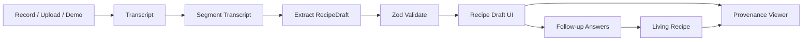

# Architecture Plan

## System Shape

RecipeTrace is a Next.js App Router prototype with a small server-side AI pipeline and a client UI built around transcript-to-recipe traceability.

## Recommended Prototype Choice

Use file-backed seeded fixtures first, then add live provider calls behind API routes.

This keeps the demo reliable while still showing full-stack architecture:

- fixtures for seeded transcript and seeded extraction
- API routes with provider calls when keys exist
- fallback to fixture data when provider calls fail
- Zod validation shared between server and client

## Frontend Surfaces

### Capture Workspace

First screen, no marketing page.

Contains:

- `Try Demo` action
- record/upload controls
- paste transcript fallback
- status rail showing capture, transcript, extraction, final

### Transcript Panel

Shows stable numbered segments.

Each segment displays:

- segment ID
- speaker if available
- transcript text
- optional timestamp range
- highlight state when selected as evidence

### Recipe Draft Panel

Shows:

- dish name and family context
- ingredients with inferred/confirmed labels
- ordered steps
- sensory cue chips grouped by type
- missing details
- follow-up questions

### Provenance Panel

The trust feature.

When a step is selected, show:

- supporting segment IDs
- exact supporting quote
- reason the quote supports the instruction
- highlighted transcript segment

### Living Recipe Page

Shows the final recipe after follow-up answers.

It should keep:

- source-backed steps
- user-provided follow-up details
- unresolved questions
- source summary

## Server Pipeline

### 1. Capture

Create a capture session from demo, upload, recording, or pasted transcript.

### 2. Transcribe

If audio exists and API keys are configured, transcribe it. If transcription fails, return a useful error and keep demo/paste paths available.

### 3. Segment

Normalize transcript into stable `TranscriptSegment[]`.

For seeded demo, segments are committed as fixtures.

For live transcript, segment by provider segments if available; otherwise sentence/paragraph chunks.

### 4. Extract

Call OpenAI structured outputs with the shared Zod schema. The model must cite segment IDs for every step.

If the live call fails, use seeded extraction only for the demo capture, never silently fake a user upload.

### 5. Validate

Run Zod validation and additional provenance checks:

- each step has at least one provenance link
- provenance segment IDs exist
- cue types are valid
- inferred items are explicitly marked

### 6. Finalize

Merge draft plus follow-up answers into `LivingRecipe`.

For the prototype, finalization can be deterministic and template-based. Use the LLM only if there is time.

## Provider Strategy

Primary path:

- OpenAI transcription or Deepgram for audio-to-text
- OpenAI structured outputs for extraction

Fallback path:

- seeded transcript fixture
- seeded validated `RecipeDraft`
- seeded final recipe fixture or deterministic finalizer

## State Strategy

For the 8-hour build, prefer local app state plus API responses. Add Supabase/Postgres only if already scaffolded or quick to wire.

Persistable shape:

- capture
- transcript segments
- recipe draft JSON
- follow-up answers
- living recipe JSON

## Quality Gates

Before demo:

- seeded demo works offline
- live API failure is graceful
- every seeded step has provenance
- invalid extraction does not render as trusted recipe
- UI makes uncertainty visible
